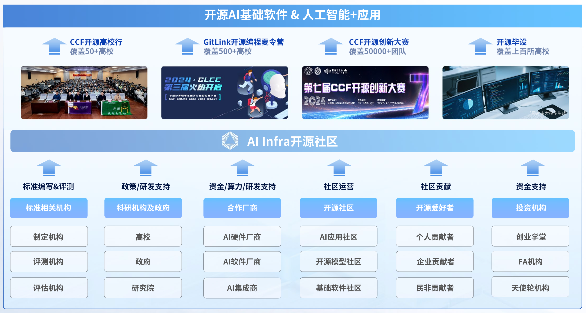

# AI Infra工作组介绍

AI Infrastructure (AI Infra) 工作组隶属于中国计算机学会（CCF）开源发展技术委员会(ODTC)，秉承创新、开放、协作、共享的理念和价值观，致力于打造新型AI Infra开源创新社区，培育孵化AI Infra创新的开源项目，培养AI Infra开源创新实践人才。

# 我们的组织架构

我们依托CCF链接科教资源、产业资源和社会资源，形成产、学、研、用、投联动的开源创新模式，探索由学术共同体主导的AI Infra开源发展新路径，为中国乃至全球开源创新实践者提供高水平开源服务，助力开源AI Infra生态建设。目前整体架构如下：

# 我们的工作内容

在中国计算机学会联合中国光华科技基金会共同发起成立的"CCF-光华青年开源基金"支持下，AI Infra工作组致力于推动AI基础设施开源软硬件生态构建，通过开源的方式标准化AI基础设施，支撑开源AI应用生态。

## 核心目标
- AI开源项目运营：通过重点开源AI项目的托管和运营，形成AI Infra开源软件基础生态。
- AI开源行业标准建立：通过开源AI基础设施、开源AI人才评估、开源AI项目评估等领域标准的构建，形成AI领域开源、开放的行业共识。
- AI生态协作平台化：构建开放协作平台，连接学术界、产业界及开源社区。

## 重点工作

### 开源项目及开发者基础设施构建
- 重点引入并重点运营3~5个AI开源项目（如AI操作系统、高性能编程框架、算力调度平台、AI推理\训练框架、开源基础大模型等）。
- 依托GitLink、GitHub等平台建立AI的开源托管。
- 制定AI开源贡献者激励计划，如：CCF开源贡献勋章、年度最佳贡献奖等。

### 开放标准制定
- 发布《CCF开源AI基础设施参考架构》，定义技术栈参考架构，发布技术栈软件参考实现。
- 牵头或参与制定AI基础设施开源标准、AI人才评估标准、AI项目评估标准等。

### 社区生态建设
- **开源校园行：** 依托CCF开源高校行系列活动，组织开源项目进校园，普及开源文化和AI技术。为在校的青年学生提供开放友好的交流环境，希望进一步推动国内开源AI社区的繁荣发展。
- **开源AI夏令营：** 通过CCF确实开源编程夏令营（AI专题），举办面向全国高校学生的暑期AI编程活动。活动将覆盖近千所高校，并联合各大开源基金会、开源企业、开源社区、开源专家，旨在鼓励青年学生通过参加真实的AI开源软件开发，提升自身技术能力，为开源社区输送优秀AI人才。
- **开源创新大赛：** 依托CCF开源GPU创新大赛，为国内开源AI社区提供展示、交流、合作的平台，激发开源创新活力，培养开源AI实践人才，发现有潜质的开源AI项目和团队。
- **举办年度AI开源峰会：** 通过CCF CNCC年度峰会汇集AI开源生态的企业、开发者共同展示开源成果，组织开发者马拉松（Hackathon），吸引社区贡献者。
- **开源联合实验室：** 推动建立“高校-企业”开源联合实验室，孵化产学研开放标准、AI开源项目等。

## 加入我们

我们诚邀对AI和开源充满热情的开发者、研究人员、学生和产业界专业人士加入我们的行列。无论您是对关键AI项目的贡献感兴趣，还是希望参与行业标准的制定，或者想参与我们的社区活动，都有很多机会可以参与其中，为AI基础设施的未来发展做出有意义的贡献。

让我们一起构建繁荣的开源AI生态系统，为全球开源AI Infra社区提供服务。

- 关注组织动态 [AI Infra](https://gitee.com/ccf-ai-infra)
- LOGO下载和使用[AI Infra LOGO](https://gitee.com/ccf-ai-infra/opengrow/tree/main/logos/AI Infra)

- 加入微信群

